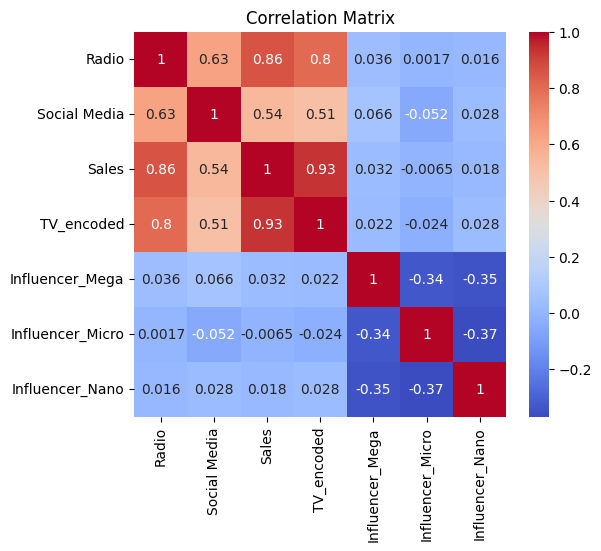
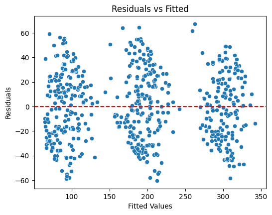
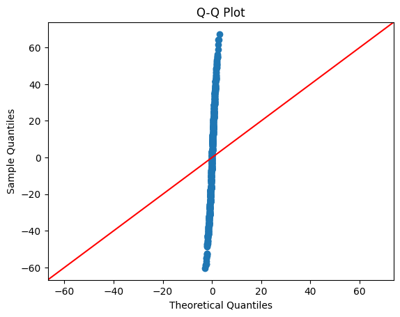
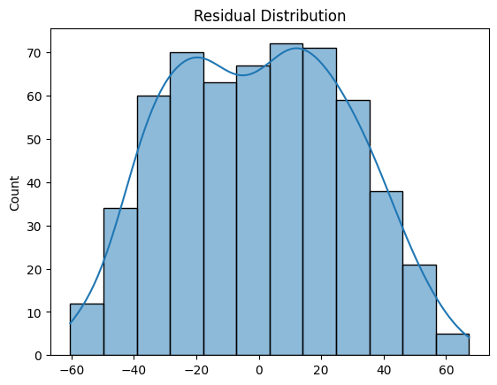

# Multiple Linear Regression – Multi-Channel Marketing Analysis

## Project Overview

This project applies Multiple Linear Regression (MLR) to evaluate the impact of different marketing channels on Sales. The analysis investigates how TV advertising, Radio advertising, Social Media advertising, and Influencer categories contribute to sales performance.

The study includes data preprocessing, multicollinearity assessment, regression modeling, diagnostic testing, and business-oriented recommendations for marketing budget allocation.

## Objectives

The objectives of this project are to:

Explore and understand the marketing dataset.
Detect multicollinearity using correlation analysis and Variance Inflation Factor (VIF).
Build a Multiple Linear Regression model using Statsmodels.
Evaluate model performance using R-squared, Adjusted R-squared, and p-values.
Validate regression assumptions through residual diagnostic plots.
Compare a full model with a reduced model.
Provide evidence-based recommendations for marketing budget allocation.

## Dataset Description

The dataset contains information on marketing activities and sales outcomes.
### Variables
| Variable     | Description                                    |
| ------------ | ---------------------------------------------- |
| TV           | TV advertising intensity (Low, Medium, High)   |
| Radio        | Radio advertising expenditure                  |
| Social Media | Social media advertising expenditure           |
| Influencer   | Influencer category (Mega, Micro, Nano, Macro) |
| Sales        | Sales generated                                |

## Data Preprocessing

Several preprocessing steps were performed before model development:

TV advertising intensity was encoded as an ordinal variable:
   Low = 1
   Medium = 2
   High = 3

Influencer categories were converted into dummy variables using one-hot encoding.
Predictor variables were converted to numeric data types where necessary.

## Exploratory Data Analysis

Initial exploration included:

Dataset structure inspection
Missing value assessment
Descriptive statistics
Correlation analysis

A correlation heatmap was used to examine relationships among numerical variables.

## Multicollinearity Assessment

Variance Inflation Factor (VIF) was calculated for all predictor variables.

### Findings

All predictor VIF values were below 5.
No evidence of problematic multicollinearity was detected.
All variables were considered suitable for inclusion in the regression model.

## Multiple Linear Regression Model

The following predictors were included in the full model:

Radio
Social Media
TV_encoded
Influencer_Mega
Influencer_Micro
Influencer_Nano
Sales was used as the dependent variable.

### Model Performance

R-squared = 0.904
Adjusted R-squared = 0.903
The model explains approximately 90.3% of the variation in Sales.

## Key Findings
### Significant Predictors

TV Advertising Intensity
Radio Advertising Expenditure

Both variables demonstrated statistically significant positive effects on Sales.

### Non-Significant Predictors
Social Media Advertising
Influencer Categories

These variables did not show statistically significant effects at the 5% significance level.

## Reduced Model Comparison
A reduced model containing only the most significant predictors was developed and compared with the full model using Adjusted R-squared.
The comparison was used to evaluate whether a simpler model could achieve similar predictive performance.

## Regression Diagnostics
The following diagnostic tests were performed:

### Residuals vs Fitted Plot
Used to assess:
Linearity
Homoscedasticity

### Q-Q Plot
Used to assess:
Normality of residuals

### Residual Distribution Histogram
Used to verify:
Approximate bell-shaped residual distribution
Results indicated that the regression assumptions were reasonably satisfied.

## Business Recommendation
Based on the analysis:
Increase investment in TV advertising.
Maintain or expand Radio advertising expenditure.
Reassess Social Media campaigns for effectiveness and return on investment.
Reevaluate Influencer marketing strategies before allocating additional budget.
Organizations seeking to maximize sales performance should prioritize TV and Radio advertising channels, as these demonstrated the strongest statistical relationship with Sales.

## Conclusion
The Multiple Linear Regression model successfully identified the primary marketing channels influencing Sales. TV advertising intensity and Radio advertising expenditure emerged as the most important predictors, while Social Media advertising and Influencer categories showed limited statistical impact.
The model achieved strong predictive performance and satisfied key regression assumptions, supporting its use as a decision-making tool for marketing budget allocation.

## Technologies Used

Python
Pandas
NumPy
Matplotlib
Seaborn
Statsmodels
SciPy
Jupyter Notebook

## Repository Contents
README.md
marketing-sales-data.csv
MLR.ipynb

## Sample Visualizations

### Correlation Heatmap

### Residuals vs Fitted

### Q-Q Plot

### Residual Distribution

## Author
[Alhassan Aliyu Liman]